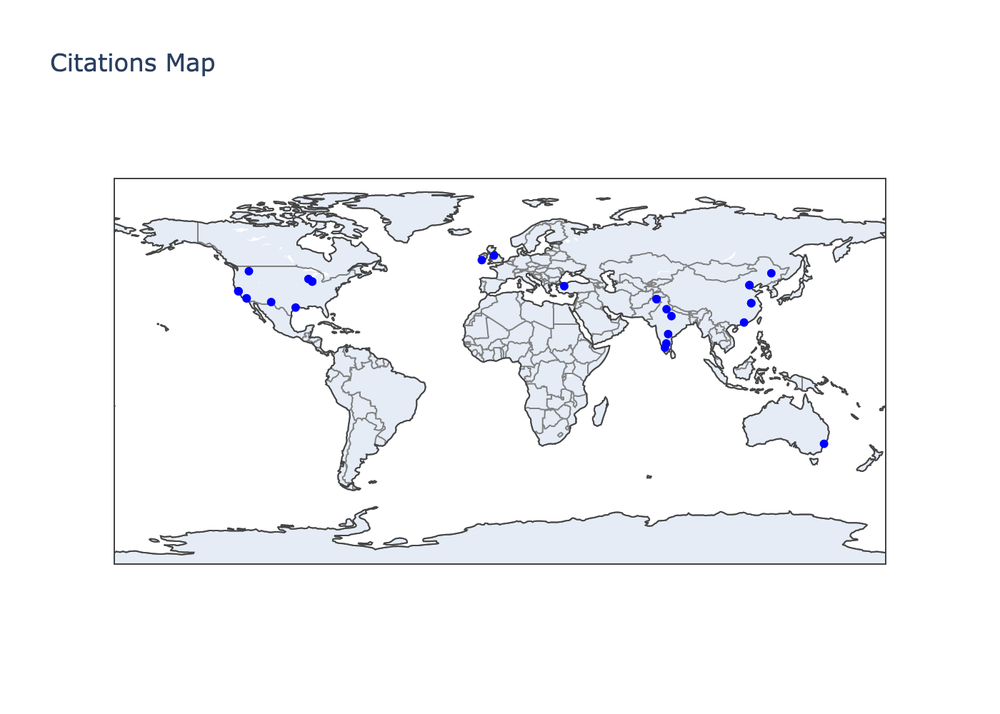

# Scholar Citation Visualizer

A Python tool that visualizes the geographical distribution of citations for a Google Scholar author. This tool fetches author details, their publications, and citations, then creates a world map showing where the citing authors are located.

## Features

- Fetches author details and publications from Google Scholar
- Analyzes citations and their authors
- Geocodes author affiliations to their geographical locations
- Creates an interactive world map visualization
- Handles various affiliation formats and common institutions

## Setup

1. Create a virtual environment:
```bash
python -m venv .venv
source .venv/bin/activate  # On Windows: .venv\Scripts\activate
```

2. Install dependencies:
```bash
pip install -r requirements.txt
```

## Usage

1. Update the `AUTHOR_ID` in `scholar.py` with your Google Scholar ID
2. Run the script:
```bash
python scholar.py
```

The script will:
- Fetch author details and publications
- Process citations
- Create a map visualization
- Save the map as `citations_map.png`

## Two-Step Review Flow (Recommended)

This flow generates a per-paper XLSX for manual review, then builds the map from
the edited XLSX.

1. Generate the review XLSX (top 4 papers by citations):
```bash
python citation_flow.py fetch
```

2. Review and edit `citations_review.xlsx` (fix city names if needed)

3. Generate the map from the edited XLSX:
```bash
python citation_flow.py map
```

Outputs:
- `citations_review.xlsx` (per-paper tabs)
- `citations_map_from_xlsx.png`
- `unmapped_cities.txt` (only if any city can't be geocoded)

## Generate Map From Column F

If you already have `citations_data.xlsx` with city/country values in Column F
across the four tabs, you can generate the map directly:

```bash
python citation_flow.py map-column-f \
  --xlsx citations_data.xlsx \
  --output aish_citation_world_map.png
```

This will:
- Read Column F from each sheet and dedupe cities
- Use/refresh `city_mapping_cache.json` for mapping
- Write `unmapped_cities.txt` if anything cannot be geocoded

## Visualization

The tool creates a world map showing the geographical distribution of citing authors. Each point on the map represents an institution where citing authors are affiliated.



## Dependencies

- scholarly
- geopy
- plotly
- kaleido
- certifi

## License

MIT License 